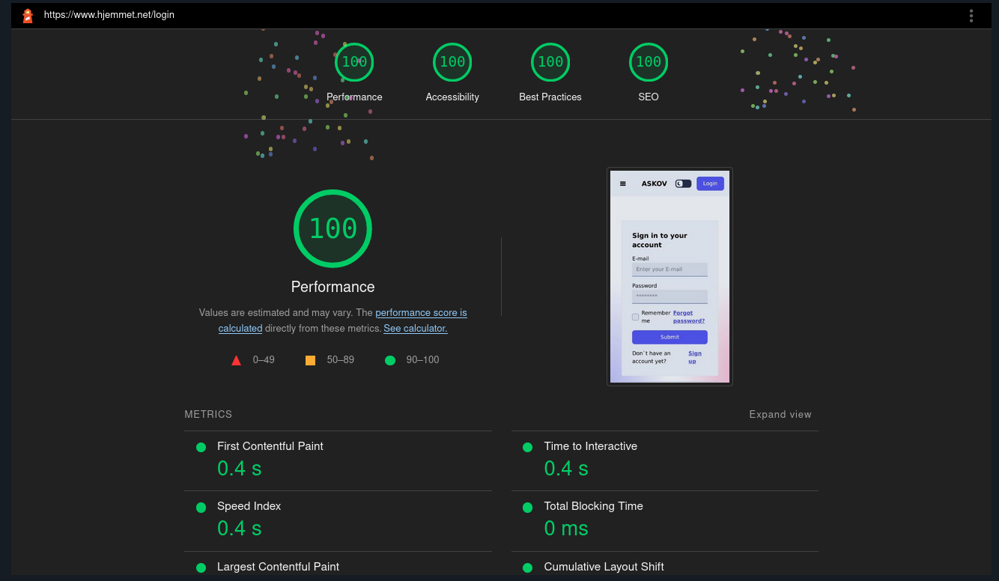

# The Hjemmet Stack

Construct a type-safe full-stack application from the database to the frontend to ensure fewer bugs and faster iterations.


## Introduction

The Hjemmet stack is built upon three fundamental components: User Experience, Type Safety, and Customizability.

## User Experience

As all good developers know, the most important aspect of web development is delivering products to our users. User experiences not only stem from the functionality of our web apps but also from the small details that often go unnoticed. An example of this can be seen with optimistic load transitions, where the animation to a new page begins before the page is loaded, making the transition seamless.

## Type Safety

Moving fast requires confidence and courage, which is only possible if we can trust the code we write. The Hjemmet stack enables end-to-end type safety from the database to the client. If a variable is changed in the database, the TypeScript compiler errors everywhere in the code where the change is not implemented. This is integrated using Prisma for type safety between the database and the server, while Zod and Superform are used for type safety between the server and client.

## Customizability

The Hjemmet stack employs Lucia-auth for authentication, as it allows for fine control over the authentication flow, which is something lacking from other libraries like Next-auth or backend-as-a-service providers.

## Performance

Sveltekit on the edge allows for fast user interactions. The pages recieves a 100% lighthouse as it is very fast and responsive. 

<div style="display: flex; justify-content: center;">
  
</div>

## Developing

Once you've created a project and installed dependencies with `pnpm install` start a development server:

```bash
pnpm run dev
```

## Hosting

Hosting is done automatically each time main branch is updated. This will trigger a rebuild and deploy the new feature within 30 seconds.
